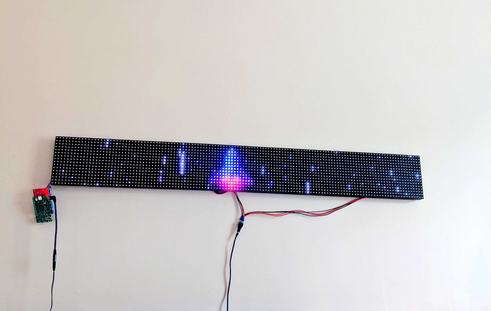

# **|||** Obelisk



## What is Obelisk? 

Obelisk is a framework and starter project for getting interactive code running on standard outdoor billboard LED panels via the web browser, based on a body of incredible work done by [Henner Zeller](https://github.com/hzeller/rpi-rgb-led-matrix) and [Alexander Eden](https://github.com/alexeden/rpi-led-matrix). 

## Hardware requirements


```
TL;DR: 
- You need panels
- You need 16-pin IDC ribbon cables to connect your panels
- You need power cables for your panels, which should have been supplied with them
- You need a power supply, with which to hook up your panels
- You need a controller, in this case a Raspberry Pi (3/4). 
- You need something to adapt the GPIO pins from a Raspberry Pi to the common 16-pin IDC format used by these kinds of LED panels
```

You'll need a set of panels meant for outdoor or indoor signage, such as [these](https://www.aliexpress.com/item/32382300128.html). Typically, they're bought in the dozens or hundreds for massive outdoor displays, but these boards aren't difficult to find on sites like Ebay or Aliexpress in small quantities. The boards I'm using are made by a company called LysonLed that sells their panels [here](https://www.aliexpress.com/store/709678).

**There are two main types of panels:**

- Indoor panels tend to be higher resolution, and cheaper. 
- Outdoor panels tend to be brighter and have higher refresh rates, usually at the expense of resolution and with increased cost. Outdoor panels also come with circuitry waterproofing, which may or may not be beneficial depending on your needs, but is almost always a plus. 

**Things to look out for when shopping for panels:**

- **Physical dimensions**, which are a product of....
- **Dot Pitch**, signified by P1, P5, P10, etc. 
	-	The pitch number represents how detailed a display is. The smaller the number, the closer the pixels are together. 
  - The number itself meaures distance in mm between each pixel. 
  - This means that a P10 32x32 panel will always be 320mm x 320mm in total dimensions, a P5 32x32 panel will be 160mm x 160mm, and so on. 
- and **Resolution**, most commonly 32x32, 32x16, and 64x32
  - Pretty self-explanatory. Most indoor panels tend to be 64x32 rectangles
- **Scan**, almost always in powers of two: 1/2, 1/4, 1/8, 1/16
  - These panels are multiplexed, meaning they only update certain rows at a time (faster than the human eye can detect) the scan rate signifies how often rows are updated. 
  - A 1/2 panel is as fast as you can get, alternating every other row. First odd number rows are updated, then even number rows, then odd, then even... 
  - A 1/8 panel updates each row every eight passes. 
  - Generally, you want as fast as you can get, but as with all things, there's a cost tradeoff. I'd say 1/4 or 1/8 scan panels are just fine for most uses. Try to avoid 1/16 panels or above unless you're doing purely static displays of text or images. 
- **Brightness**, measured in cd/m2
  - Outdoor panels typically exceed 6000cd/m2, which is incredibly bright. 
  - Indoor panels typically come in under 4000cd/m2
  - How bright is bright? In general, if you're creating a project for home use like an information display, stick to an indoor panel. Outdoor panels are genuinely an attention-getting level of bright. They're awesome for offices or commercial spaces, but you might find them overkill at home unless you have a particularly bright space. 
- **SMD** means Surface Mount Device, denoting that the LEDs on the module in question are not discrete, but rather combine all three emitting colours into one small element. Pretty much all panels on the market use SMDs. There are differnt models of SMD, ie SMD2835, SMD3535, SMD2727. For the most part, you can ignore this as long as all the other specifications above look good. 

Typically, these panels actually have significant power draw requirements. Yes, they are LEDs, but a 32x16 panel has 512 of them, and each LED has Red, Blue, and Green components, which means you need a lot of POWEERRRR. Your panel vendor will typically list power requirements in the specifications, but a good rule of thumb is to expect 30W of draw per indoor panel, and 50W of draw for an outdoor panel. You will need a 5V switched-mode power supply [such as this one](https://www.amazon.com/Aclorol-Universal-Transformer-Switching-Converter/) to help you out. 

These panels are essentially 'raw' LEDs with no intelligence behind them. You need a computer with GPIO capability to control them. An Arduino or Sparkfun Adafruit are usable with HZeller's original library, but this project is meant to be run on a Raspberry Pi. I'd recommend an RPi4 if you can get your hands on one — otherwise, an RPi3 should work just fine. 

You also need an adaptor for the GPIO pins on your Raspberry Pi to match the common 16-pin IDC format used by these kinds of LED panels. I recommend [this one made by ElectroDragon](https://www.electrodragon.com/product/rgb-matrix-panel-drive-board-raspberry-pi/), based of Henner Zeller's schematics. There are also some other panels schematics available in [his GitHub repo](https://github.com/hzeller/rpi-rgb-led-matrix) to address other specific needs. I'll also soon be offering passive panels of my own design for sale, by mail, which you'll need minimal soldering experience to make work for you. 

## Getting all set up with the software

 You'll need:
 
- **Git**, used to pull the project code. 
- **GCC**, to compile hzeller's original code, which this project draws from. 
- **NVM + Node** as the best way to get sudo-less Node code running on an RPi
- **Yarn** is used to manage the workspaces (server + client) of the project. 

On a Raspberry Pi, you'll want to do most of this manually. 

#### Disable sound

The RPi uses the same high-frequency hardware (called a pulse generator) to drive the board as it does to generate sound. As a result, you actually cannot use sound functionality at the same time as driving a board, and it must be disabled. See HZeller's Github for advice on how to achieve this. 

#### Install Git

Raspbian comes with Apt, so this is as simple as

```
apt-get git
```


#### Install NVM

https://github.com/nvm-sh/nvm#installing-and-updating

```
curl -o- https://raw.githubusercontent.com/nvm-sh/nvm/v0.35.3/install.sh | bash
```

You'll need to `ln -s` nvm to the proper directory as well.


#### Install Yarn 

https://classic.yarnpkg.com/en/docs/install#debian-stable

```
curl -sS https://dl.yarnpkg.com/debian/pubkey.gpg | sudo apt-key add -
echo "deb https://dl.yarnpkg.com/debian/ stable main" | sudo tee /etc/apt/sources.list.d/yarn.list
sudo apt update && sudo apt install --no-install-recommends yarn
```

#### Get Packages

With the terminal, `cd` into your `obelisk` directory and run: 

```
yarn
```

#### Configuration

First, you'll need to configure your panel by copying `obelisk-server/config.example.ts` to `obelisk-server/config.ts`. I would recommend reading through [Henner Zeller](https://github.com/hzeller/rpi-rgb-led-matrix) and [Alexander Eden](https://github.com/alexeden/rpi-led-matrix)'s repos to understand what all the settings do — the documentation is quite comprehensive, and they've both done a wonderful job with their explanations. 

For this project in particular, you'll want to pay attention to: 

```
let config = {
  verbose: true,
  runServer: true,
  initPanel: false
};
```

- Verbose turns on logging for the server. Otherwise, logs will be mininally displayed via a dashboard. 
- There's no reason to 'runServer' if you won't be internet connected. If 'runServer' is false, you'll be able to choose options via the CLI instead of waiting for a phone to connect. 
- You won't be able to run in full mode, panel enabled, on your development machine. For this, you'll need to make sure `initPanel` is set to `false`. 

## Getting running with the Sample Project


You can then run the server: 

```
yarn obelisk
```

Running the client for development: 

```
yarn workspace obelisk-client clientstart
```

Building a new client verson: 

```
yarn workspace obelisk-client clientbuild
```

Have fun! 
